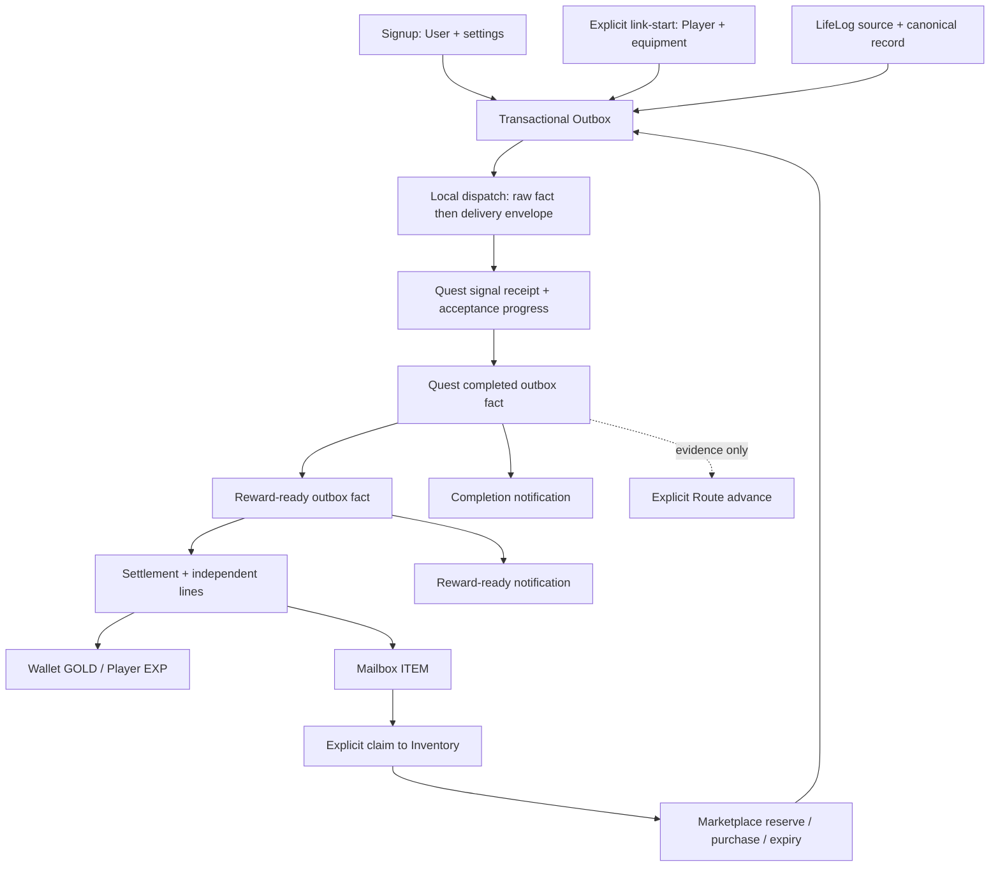

# Content registration and event delivery

Source review for [#364](https://github.com/LifeAsGame/lifeasgame-backend/issues/364), after [#363](https://github.com/LifeAsGame/lifeasgame-backend/pull/363). Baseline: `origin/develop` at `32651b3903283f0b92e4c156379425ecc3f2f95e` (refreshed at the start of this review).

This document describes checked-in definitions and executable paths. **No running database, deployment configuration, HTTP environment or production registration state was inspected.** “Installed” below means the result intended by migrations/bootstrap, conditional on successful execution. Tests are cited as existing coverage inspected in source, not as tests executed for this review. This change adds no content, activation policy, schema or product code.

## Existing authority and resolved findings

Use the existing [reward contract](../contracts/reward/adventure-preparation.md), [admin contract](../contracts/admin/admin-v1-contract.md), [database inventory](../database/current_schema_inventory.md) and [Flyway runbook](../database/flyway_baseline_runbook.md) alongside this map. The historical [runtime audit](https://github.com/LifeAsGame/lifeasgame-backend/tree/0f3473dcd004e48acbde377a036921ad7739ad1c/docs/architecture/audits/user-service-runtime-gap-v1) is historical evidence, not current implementation authority; its files were removed during documentation curation. The proposed activation-manifest [PR #334](https://github.com/LifeAsGame/lifeasgame-backend/pull/334) closed without merging; no shipped manifest/preflight path is assumed here.

| Historical concern | Current source disposition |
| --- | --- |
| Marketplace purchase relied on expiring Redis idempotency | `MarketplaceService.purchase` now uses the durable buyer/key receipt and payload fingerprint from V32, with Inventory transfer in the same transaction. Do not reimplement this. |
| Player onboarding could leave partial initialization | `PlayerOnboardingInitializer.initialize` encloses Player/equipment initialization and outbox persistence; `PlayerFacade.linkStart` issues tokens afterwards. |
| Default User settings waited for event delivery | `UserWriter.register` and `registerByOAuth` call `ensureDefaultIfMissing` before publishing. The event listener is now an idempotent compatibility path. |
| Marketplace reservations never expired automatically | #361 added `@EnableScheduling` to `LifeasgameApplication`; `EconomyReservationSchedulingIntegrationTest` exercises the registered job. Outbox has its own scheduler. |
| Journal projection duplication | #363 extracted the common projection. No Journal rewrite is needed for this audit. |
| Missing notification source-to-row proof | `QuestNotificationSourceToRowIntegrationTest` now covers source dispatch, per-event replay, failure/retry and copy snapshots. The narrower parent-to-child replay gap below remains. |
| Paid Shop completion has no final entitlement consumer | Still a known deferred boundary. The existence of controllers/events does not authorize paid checkout, top-up, equipment writes or other restricted functionality. |

## Content inventory and registration

### Quest

The executable catalog comes from [SeedLevel1Quest](../../src/main/java/online/lifeasgame/quest/domain/seed/SeedLevel1Quest.java), through [SeedLevel1QuestBlueprintAdapter.toBlueprint](../../src/main/java/online/lifeasgame/quest/application/blueprint/SeedLevel1QuestBlueprintAdapter.java) and [StaticQuestBlueprintCatalog](../../src/main/java/online/lifeasgame/quest/application/blueprint/StaticQuestBlueprintCatalog.java). All six definitions have `seedLevel=1`, priority P0, definition version **1**, status **ACTIVE**, and no availability start/end. Their display order is 10–60 as listed below. These are catalog metadata, not a database activation gate.

| Stable code / Korean display name | Condition and repetition | Reward profile | Initial registration |
| --- | --- | --- | --- |
| `Q_RECORD_FIRST_TRACE` / 첫 흔적 남기기 | RECORD; one distinct content-ready LifeLog after acceptance; COUNT 1; AUTO; ONCE | `RP_EXP_TINY_10` | V20 insert, V34 reconcile; bootstrap ensures absent row |
| `Q_RECORD_THREE_TRACES` / 흔적 세 개 이어보기 | RECORD; three distinct content-ready LifeLogs after acceptance; COUNT 3; AUTO; ONCE | `RP_EXP_AND_ITEM_FIRST_STEP_20` | V20, V34; bootstrap |
| `Q_RECORD_WEEKLY_LOOKBACK` / 이번 주 흔적 돌아보기 | RECORD; FULL + REFLECTION + WEEKLY_LOOKBACK, matching period key; COUNT 1; AUTO; WEEKLY | `RP_NONE` | V20, V34; bootstrap |
| `Q_GROWTH_ONE_FOCUS` / 한 가지에 25분 집중하기 | GROWTH; MANUAL_CHECK, MINUTES 25; USER_CONFIRM; DAILY; focus label 1–80 characters at acceptance | `RP_NONE` | Bootstrap |
| `Q_RECOVERY_REST_TEN` / 10분 쉬어가기 | RECOVERY; MANUAL_CHECK, MINUTES 10; USER_CONFIRM; DAILY | `RP_NONE` | Bootstrap |
| `Q_ADVENTURE_PREPARATION` / 모험의 준비 | RECORD; three distinct content-ready LifeLogs after acceptance; COUNT 3; AUTO; ONCE; optional, not a signup grant | `RP_ADVENTURE_PREPARATION` | Bootstrap after V36 reward dependencies |

Manual minutes are a user confirmation contract, not elapsed-time measurement or proof of real-world activity. The LifeLog trigger uses `EXISTING_ONLY`; edits, pre-acceptance records and source replay do not count as new activity. Weekly metadata describes a player-profile timezone policy, but both current `DefaultPlayerTimezoneResolver` implementations return **Asia/Seoul** unconditionally. Per-player timezone behavior is not implemented by that label.

[QuestDefinitionBootstrapper.run](../../src/main/java/online/lifeasgame/quest/application/bootstrap/QuestDefinitionBootstrapper.java) is a transactional `ApplicationRunner`, enabled by `app.quest.definition-bootstrap.enabled=true` with `matchIfMissing=true`. [QuestDefinitionProvisioner.resolve](../../src/main/java/online/lifeasgame/quest/application/QuestDefinitionProvisioner.java) returns an existing DB row first. Only an absent row is materialized from Java, with active reward-profile lookup and a `QUEST_CREATED` outbox event. It does **not** compare, upgrade or synchronize existing definitions. The same provisioner is used from command/signal paths; this is not a GET-side repair mechanism.

The adapter retains code, version, semantic category, target, repetition, completion/progress policy and reward profile. It uses the **long** description. Seed status, availability windows, priority, icon/copy keys and some descriptive condition metadata do not become independently enforced DB fields. [V34](../../src/main/resources/db/migration/V34__consumer_content_runtime_reconciliation.sql) sets **short** descriptions for the three SQL-seeded quests while leaving version 1; their static catalog and DB description values therefore differ by construction. This is a source-confirmed representation difference, not evidence of incorrect reward amounts.

[QuestCode](../../src/main/java/online/lifeasgame/quest/domain/QuestCode.java) also retains 16 legacy codes: `quest:player:welcome`, `quest:player:level:progress`, `quest:player:level:reach10` through `reach100` in tens, `quest:exercise:minutes-300`, `quest:collection:hunter-10`, `quest:media:binge-5`, `quest:inventory:collector-100`. Their registered triggers still produce signals. They have **no current static blueprint**; when no corresponding DB Quest exists, the signal is receipted without progress. If historical DB rows exist, `resolve` can return them and the legacy signal path can process them. Their stored names, versions, rewards and presence were not checked. Do not count enum/trigger membership as 16 newly available quests or restore them automatically. Public acceptance requires membership in the current catalog.

### Items and rewards

[SeedLevel1Item](../../src/main/java/online/lifeasgame/inventory/domain/seed/SeedLevel1Item.java) and [SeedLevel1RewardProfile](../../src/main/java/online/lifeasgame/reward/domain/seed/SeedLevel1RewardProfile.java) are descriptive seed catalogs; no main-code bootstrap caller installs their lists. SQL installs the rows, and runtime readers use DB data. Item and reward content do not have Quest-style definition versions; entity locking versions must not be treated as content versions.

| Stable item code / name | Properties and binding | SQL installation |
| --- | --- | --- |
| `IT_FIRST_STEP_FRAGMENT` / 첫걸음의 조각 | QUEST / ETC / COMMON; empty base attributes; stackable 99; no durability; null description; reward-bound | [V12](../../src/main/resources/db/migration/V12__item_stable_code_and_first_step_seed.sql), V34 normalization, V36 bound default |
| `IT_RECORD_CRYSTAL` / 기록 결정 | MISC / ETC / COMMON; empty attributes; stackable 99; no durability; unbound; “활동 기록 퀘스트에서 얻는 수집품. 보관하거나 거래할 수 있습니다.” | [V36](../../src/main/resources/db/migration/V36__adventure_preparation_rewards.sql) |

Neither item defines an active status, equipment effect, consumption, crafting or enhancement. The inventory of two codes is the shipped fixed-code seed inventory, not the count of all possible DB/admin-created items. [AdminItemController](../../src/main/java/online/lifeasgame/inventory/api/admin/AdminItemController.java) exposes `/admin/v1/items` CRUD through `ItemService`; its create/update commands do not accept stable item code, description or reward-bound metadata. That path alone does not register a new code-addressable reward item. No automatic Item-created or Reward-definition-created fact is published by these services.

The following is the intended **post-V36** reward-definition state from [V2](../../src/main/resources/db/migration/V2__reward_definition_foundation.sql), [V13](../../src/main/resources/db/migration/V13__first_step_reward_profile_seed.sql), [V18](../../src/main/resources/db/migration/V18__reward_item_code_snapshot.sql), V34 and V36:

| Definition code / name | Type / base amount / item linkage | Active |
| --- | --- | --- |
| `EXP_PLAYER` / Player EXP | EXP 10; V34 renames `RD_EXP_10` in place, preserving FK references | Yes |
| `RD_EXP_30` / EXP 30 | EXP 30; retained legacy definition | Yes |
| `RD_EXP_20` / EXP 20 | EXP 20; replaced in current profile links by `EXP_PLAYER` + override | No |
| `ITEM_DEFINITION` / Item Definition | ITEM 1 → `IT_FIRST_STEP_FRAGMENT`; V34 renames `RD_ITEM_FIRST_STEP_FRAGMENT_1` in place | Yes |
| `RD_ADVENTURE_GOLD` / 모험의 준비 GOLD | GOLD 100 | Yes |
| `RD_RECORD_CRYSTAL` / 기록 결정 | ITEM 1 → `IT_RECORD_CRYSTAL` | Yes |

| Profile code / name | Ordered effective rewards | Status / current use |
| --- | --- | --- |
| `RP_EXP_10` / EXP 10 Profile | sort 0: `EXP_PLAYER`, amount 10 inherited | ACTIVE; retained, no current catalog Quest link |
| `RP_EXP_30` / EXP 30 Profile | sort 0: `RD_EXP_30`, amount 30 inherited | ACTIVE; retained, no current catalog Quest link |
| `RP_NONE` / No Reward Profile | No lines ([V5](../../src/main/resources/db/migration/V5__reward_none_profile.sql)) | ACTIVE; weekly/focus/rest; empty settlement completes without grants |
| `RP_EXP_TINY_10` / 소량 EXP | sort 1: `EXP_PLAYER`, override 10 | ACTIVE; first trace |
| `RP_EXP_AND_ITEM_FIRST_STEP_20` / EXP 20 + First Step Fragment | sort 1: `EXP_PLAYER`, override 20; sort 2: `ITEM_DEFINITION`, override 1 | ACTIVE; three traces |
| `RP_ADVENTURE_PREPARATION` / 모험의 준비 보상 | sort 1: `RD_ADVENTURE_GOLD` 100; sort 2: `RD_RECORD_CRYSTAL` 1 | ACTIVE; adventure; account entitlement `ADVENTURE_PREPARATION` |

Only the last three rewarded profiles occur in the Java reward seed catalog. Adventure Java lines specify 100/1 overrides; SQL uses null overrides and definition amounts 100/1. Effective amounts agree today, although the representations differ. Item reward lines carry both stable item code and ID; Inventory resolves the code at delivery. `RewardDefinitionService.create/update` can mutate definitions as application methods, but no production caller/controller for that service was found; this is not a shipped reward-authoring HTTP surface; `RewardProfileReader`/`RewardProfileLookupService` resolve active DB profiles. Reward amounts are snapshotted into settlement lines **when the settlement is created**, not at Quest completion. Do not describe completion as a frozen reward-line snapshot or as successful payout.

### Route

[V20](../../src/main/resources/db/migration/V20__quest_route_mvp.sql) installs and V34 reconciles `ROUTE_RECORD_START`, version **1**, **기록을 시작하는 길**: “하루의 한 장면을 남기고, 여러 흔적을 이어, 다시 돌아보는 가장 작은 기록 여정.” There is no Java Route seed catalog/bootstrap and no Route reward linkage. Route definitions have no active/window field; Step codes are scoped to the Route and have no separate definition version.

| Step code / order / name | Required Quest |
| --- | --- |
| `RS_RECORD_01_LEAVE_TRACE` / 1 / 한 장면 남기기 | `Q_RECORD_FIRST_TRACE` |
| `RS_RECORD_02_CONNECT_TRACES` / 2 / 흔적 이어보기 | `Q_RECORD_THREE_TRACES` |
| `RS_RECORD_03_LOOK_BACK` / 3 / 돌아보고 다음 장 열기 | `Q_RECORD_WEEKLY_LOOKBACK` |

All use `QUEST_COMPLETION_SET`, required evidence count 1, `userAdvanceRequired=true`, `retroactiveEvidenceAllowed=true`, `skipAllowed=false`. [QuestRouteAdvanceService.advance](../../src/main/java/online/lifeasgame/quest/application/QuestRouteAdvanceService.java) locks the current player's selected Route and validates `expectedStepId` plus evidence before moving one Step. Quest completion never automatically advances a Route; selection remains optional and is not a global single-active-route policy.

### Installation is separate from visibility

| Surface | Definition/lookup authority | Meaning and limit |
| --- | --- | --- |
| `GET /api/v1/quests/catalog` | `QuestQueryService.getCatalog` → static Java blueprints | Lists six definitions even if DB installation/bootstrap is absent. Does not query installed status. |
| `/admin/v1/quests/definitions` | `QuestQueryService.getDefinitions/getDefinition` → Quest DB rows; admin command boundary for writes | Can show installed/historical rows distinct from catalog. Not the public catalog. |
| `/api/v1/players/quests` and code detail | Current-player acceptances + DB definitions; catalog guard on acceptance | Existing state, repeat/period checks and commands determine eligibility. GET stays read-only. |
| `/api/v1/items` | `ItemQueryService` → DB search/detail | No seed-membership or active-flag filter; registration is not an entitlement grant. |
| `/api/v1/quest-routes` | `QuestRouteQueryService` → all DB Route definitions + owned selection state | No activation flag; DB presence controls the definition list. |
| Reward settlement GET | Owned settlement and its stored lines | ITEM success is Mailbox delivery, not claim; GOLD success is a credit fact, not current balance. |

See [QuestQueryService](../../src/main/java/online/lifeasgame/quest/application/QuestQueryService.java), [ItemController](../../src/main/java/online/lifeasgame/inventory/api/player/ItemController.java), [QuestRouteQueryService](../../src/main/java/online/lifeasgame/quest/application/QuestRouteQueryService.java). Default Flyway is off in [application.yml](../../src/main/resources/application.yml), on in [local](../../src/main/resources/application-local.yml), and `${FLYWAY_ENABLED:false}` in [prod](../../src/main/resources/application-prod.yml). Hibernate validation is not seed installation. Bootstrap's separate default-on switch does not install Item/Reward/Route prerequisites. No deployment environment overrides or `flyway_schema_history` were inspected.

## Event delivery and state transitions

### Shared transport contract

[TransactionalOutboxDomainEventPublisher](../../src/main/java/online/lifeasgame/platform/outbox/application/TransactionalOutboxDomainEventPublisher.java) requires an existing transaction (`MANDATORY`) and stores encoded payload plus a **new random event UUID per publish call**. Correlation strings are not global deduplication keys. Domain state and its required outbox row commit together; SQL migrations themselves do not emit domain events.

[OutboxRelayScheduler](../../src/main/java/online/lifeasgame/platform/outbox/application/OutboxRelayScheduler.java) is a `SmartLifecycle` with its own `ScheduledExecutorService`, independent of Spring `@Scheduled`. Defaults: enabled, fixed delay 500 ms, batch 50, max attempts 10, retry delay 1,000 ms, lease 30,000 ms; environment properties may override these. Claim and stale-lease queries use `FOR UPDATE SKIP LOCKED`. Dispatch, completion and failure bookkeeping use separate transactions. [LocalDomainEventDispatcher](../../src/main/java/online/lifeasgame/platform/outbox/application/LocalDomainEventDispatcher.java) synchronously publishes the raw domain event, then `OutboxEventDelivery(eventId, event)`.

Delivery is **at least once**: a nested consumer transaction can commit before a later listener fails or before parent acknowledgement. Runtime exceptions trigger persisted attempts, delayed retry and finally `FAILED`; stale processing leases are recovered. Failure text stores the exception class rather than payload. `FAILED` is a visible terminal delivery state, not a guarantee of eventual processing. Optional Redis Quest/Economy publication is AFTER_COMMIT, catches/logs errors, and is not the durable consumer transport. No Redis retry receipt or exactly-once guarantee follows from Outbox.

### Publisher, transaction, consumer and replay map

`NEW` below means `REQUIRES_NEW`; all named outbox facts use the shared retry contract above unless otherwise stated.

| Source / publisher | Transaction and delivery | Consumers, identity and failure behavior |
| --- | --- | --- |
| `UserRegistered`: [UserWriter.register/registerByOAuth](../../src/main/java/online/lifeasgame/user/application/UserWriter.java) | MANDATORY in signup transaction; settings first, outbox second | `UserOnBoardingPolicy` BEFORE_COMMIT during relay dispatch ensures settings again. It does not create Player. Settings uniqueness/ensure supplies idempotency. |
| `PlayerRegistered`: [PlayerOnboardingInitializer.initialize](../../src/main/java/online/lifeasgame/character/application/PlayerOnboardingInitializer.java) drains Player events | One transaction for Player + equipment + outbox; existing Player path locks/verifies initialization | `QuestEventBridge` → `PlayerRegisteredQuestTrigger` emits legacy welcome/level signals. User/Player identity and initialization checks prevent duplicate onboarding; signal receipts protect progress. Not an automatic adventure grant. |
| `LifeLogRecorded`: Collection/Exercise/Media create services (also called by `QuickRecordService.record`), using [LifeLogRecordRegistrar.register](../../src/main/java/online/lifeasgame/lifelog/application/record/LifeLogRecordRegistrar.java) | Source row + canonical record + fact in caller transaction; registrar MANDATORY. Quick requests add a locked `(playerId, idempotencyKey)` receipt and request hash in that transaction | `QuestEventBridge` → `LifeLogRecordedQuestTrigger`; content-ready facts only, LifeLog-ID correlation, existing acceptance only. Legacy metadata alone does not advance the six content quests. |
| `CollectionLogged`, `ExerciseLogged`, `MediaLogAdvanced`, `PlayerLeveledUp`, `InventoryItemAdded` | Their source service/aggregate drains facts into outbox in the mutation transaction | Registered legacy Quest triggers still translate them; source-derived correlation → `(questCode, playerId, correlationId)` signal receipt and payload fingerprint. No current blueprint for their legacy target codes; historical DB state matters. |
| Quest signal processing: [QuestSignalProcessingAttempt.process](../../src/main/java/online/lifeasgame/quest/application/automation/QuestSignalProcessingAttempt.java) | NEW receipt + acceptance/progress + transition outbox rows atomically; collision recovery in a new transaction validates fingerprint | `QUEST_PROGRESS`, `QUEST_GOAL_REACHED`, AUTO `QUEST_COMPLETED`. Acceptance `@Version` protects concurrent updates; retry uses rolled-back receipt. Occurred-at/acceptance/period checks apply. Redis progress cache sync is after-commit best effort, not authority. |
| Quest commands: definition provisioning/update, accept, manual-check/completion | Command transaction records state and factory-produced `QUEST_CREATED/UPDATED/ACCEPTED/PROGRESS/GOAL_REACHED/COMPLETED` | Completion snapshots Quest identity/version, acceptance, title and reward profile code. Route remains evidence-driven; no automatic advance consumer. |
| Completion → [QuestRewardReadyPublisher.onQuestEvent](../../src/main/java/online/lifeasgame/quest/application/event/QuestRewardReadyPublisher.java) | Raw event listener, NEW; emits typed `QuestRewardReadyFact`; legacy `QUEST_REWARD_READY` also upgraded | No parent-delivery receipt. Stable correlation does not prevent fresh child UUIDs on replay; see finding 1. Missing required reward identity can produce no child fact; it is not invented. |
| Typed reward-ready → [QuestRewardReadyBridge](../../src/main/java/online/lifeasgame/reward/application/event/QuestRewardReadyBridge.java) → `QuestCompletionRewardService` | Settlement creation NEW, each line independently NEW; not one transaction for the complete reward | Unique `(player, sourceType=QUEST_COMPLETION, acceptanceId)` settlement; profile match on replay; line status/idempotency prevents repeat effect. Adventure additionally reserves unique `(accountId, ADVENTURE_PREPARATION)` atomically at creation; duplicate account reward is NOT_ELIGIBLE. |
| GOLD / EXP / ITEM settlement lines | Settlement lock then provider-owned application boundary; provider writes join the line transaction | GOLD `RewardGoldCreditor`: Wallet + receipt keyed rewardLineId. EXP `PlayerRewardExpGrantService.grantRewardExp`: growth ledger keyed rewardLineId, Player lock, and `PlayerExpGrantService` mutation/level-up outbox. ITEM `InventoryRewardDeliveryService`: mailbox lock + delivery receipt keyed rewardLineId. Successful line with missing receipt fails closed. Persisted domain failures remain FAILED until explicit internal retry preparation; system failures propagate for outbox retry. |
| [MailboxService.claim/claimAll](../../src/main/java/online/lifeasgame/inventory/application/MailboxService.java) | Explicit current-player command; mailbox then Inventory locks; capacity checked before applying; both states + `InventoryItemAdded` outbox atomic | Reward-delivery receipt is not a claim receipt. Claim consumes stored slot quantity; no claim request idempotency key. Repeating a partial-quantity claim is another command while stock remains. |
| Completion/reward-ready → [notification handlers](../../src/main/java/online/lifeasgame/notification/application/event) | Delivery envelope, `NotificationAppendAttempt.append` NEW | Unique `(playerId, sourceEventId)`; replay/collision recovery checks existence and preserves the stored row, without a payload-fingerprint comparison. Copy provenance/title snapshots, no live Quest-title reconstruction. Same UUID replay dedupes; distinct child UUIDs do not. Missing required legacy copy/title fails visibly through outbox retry/FAILED. |
| Marketplace open/reserve/purchase/cancel/expiry: [ListingOpenService](../../src/main/java/online/lifeasgame/economy/application/ListingOpenService.java), [MarketplaceService](../../src/main/java/online/lifeasgame/economy/application/MarketplaceService.java) | Each command transaction includes Inventory availability/transfer, Wallet hold/effect and outbox facts | Purchase has durable `(buyerId, idempotencyKey)` + listing/token fingerprint. Reservation token/one-ACTIVE constraint controls reserve/consume. Expiry releases Wallet hold and Inventory trade reservation once. Transfer is already committed before asynchronous purchase listeners. |
| `SHOP_*`, `TOPUP_COMPLETED`, `WALLET_ADJUSTED`: `ShopService`, `TopUpService` | Existing application transactions + outbox; Shop uses Redis reservation/idempotency paths in addition to DB state | Code paths exist, but are not proof of approved public checkout/payment fulfillment. Preserve the current restricted product contract. |
| Purchase completion → [EconomySagaCoordinator.onEconomyEvent](../../src/main/java/online/lifeasgame/economy/application/saga/EconomySagaCoordinator.java) | Raw event listener, NEW → `FULFILLMENT_READY` | No parent receipt; same child duplication pattern. No final entitlement consumer found. Marketplace transfers synchronously; Shop cannot be declared fulfilled because this event exists. |

### Event names that do not establish a running feature

[OutboxEventCodecRegistry](../../src/main/java/online/lifeasgame/platform/outbox/application/codec/OutboxEventCodecRegistry.java) registers 12 aliases: `user.registered.v1`, `player.registered.v1`, `player.leveled-up.v1`, `inventory.item-added.v1`, `lifelog.collection-logged.v1`, `lifelog.exercise-logged.v1`, `lifelog.recorded.v1`, `lifelog.media-advanced.v1`, `social.chat-channel-deactivated.v1`, `quest.event.v1`, `quest.reward-ready.v1`, `economy.event.v1`. Codec registration means decodable, not enabled product behavior. Social channel deactivation is outside this content journey.

| Enum family | Actual production producers / remaining declarations |
| --- | --- |
| [QuestEventType](../../src/main/java/online/lifeasgame/quest/domain/event/QuestEventType.java) | Factories produce CREATED, UPDATED, ACCEPTED, PROGRESS, GOAL_REACHED, COMPLETED (all `QUEST_` prefixed). `QUEST_REWARD_READY` is consumed for legacy upgrade, not emitted by the current completion publisher. `PLAYER_REGISTERED`, `PLAYER_LEVEL_UP`, `ITEM_COLLECTED`, `RESOURCE_GATHERED`, `BOSS_DEFEATED` have no QuestEvent producer; separate typed Player/Inventory events must not be confused with these enum constants. |
| [EconomyEventType](../../src/main/java/online/lifeasgame/economy/domain/event/EconomyEventType.java) | All constants except `LISTING_EXPIRED` have producer call sites. `LISTING_RESERVATION_EXPIRED` is the real reservation-cleanup fact. `FULFILLMENT_READY` is produced but has no final fulfillment consumer. Presence of Shop/top-up producers does not activate those product capabilities. |
| [NotificationType](../../src/main/java/online/lifeasgame/notification/domain/NotificationType.java) | Only QUEST_COMPLETED and QUEST_REWARD_READY have production source-to-inbox handlers in this journey. Other declared types do not imply a new notification trigger. |

### Scheduling, ownership and lock boundaries

[EconomyReservationScheduler.expireReservations](../../src/main/java/online/lifeasgame/economy/application/EconomyReservationScheduler.java) is the only production `@Scheduled` method found. It runs Marketplace then Shop with fixed delay `${lifeasgame.economy.reservation-expiry-ms:60000}`; failures are logged and the next run retries. Because both calls share one try block, a Marketplace failure skips Shop for that run. Each service owns its own transaction. This scheduler is enabled by the main application; it neither invokes checkout nor shares Outbox's executor.

Marketplace keeps the Listing row OPEN during a reservation and overlays RESERVED from an ACTIVE reservation for reads. Passing TTL alone does not rewrite GET results: cleanup must commit first. Cleanup locks Listing → active reservation → buyer Wallet → seller Inventory, expires the hold and reservation, releases trade reservation while leaving the item listed, and emits `LISTING_RESERVATION_EXPIRED`. Purchased/consumed reservations are excluded. Cancellation later releases listing availability. This preserves the existing strict expiry boundary and avoids hidden GET writes.

| Boundary | Ownership / concurrency review |
| --- | --- |
| Quest ↔ Reward | `RewardProfileLookupApi` and typed `QuestRewardReadyFact`; no foreign Reward entity dependency needed. Signal receipt and acceptance optimistic version handle replay/concurrent progress; manual completion uses an acceptance lock. |
| Reward ↔ Character/Economy/Inventory | Provider-owned internal APIs; settlement identity and per-line receipts separate delivery from payout. Account entitlement survives Player recreation. No caller-supplied reward recipient/amount is trusted on player APIs. |
| LifeLog ↔ Role | Registrar uses owned Role/RoleEvent lookup APIs. RoleEvent lifecycle does not implicitly create a LifeLog. |
| Mailbox → Inventory | Locks mailbox then Inventory; plans all additions before mutation. GET/query code does not repair containers. |
| Marketplace transfer | Purchase: receipt → Listing → reservation → buyer Wallet → seller Wallet → Inventory pair. [InventoryMarketTransferService.transferWholeEntry](../../src/main/java/online/lifeasgame/inventory/application/InventoryMarketTransferService.java) orders Inventory locks by ascending player ID. Wallet locks remain buyer-first rather than globally ordered; reciprocal-trade risk below. |
| Route | Player-owned selection + pessimistic lock + expected-current-step contract; past completion can satisfy evidence; repeated advance cannot skip a Step. |
| Optional Redis Economy bridge | Application layer directly imports `RedisEconomyEventPublisher` from infra, and both are listeners. The duplicate listener path is a local responsibility defect, not a reason for a repository-wide event framework. |

## Findings and follow-up order

“Source-confirmed” means a concrete call path/definition contradiction was established in this review. None of these findings is a claim of a reproduced production incident. “Risk” requires the stated state or interleaving to be tested.

### 1. Parent replay creates duplicate reward-ready facts and notifications — source-confirmed, first implementation PR

**Files/symbols:** `QuestRewardReadyPublisher.onQuestEvent`, `TransactionalOutboxDomainEventPublisher.publish`, `LocalDomainEventDispatcher.dispatch`, `QuestRewardReadyNotificationHandler.onOutboxEvent` (see linked sources above and [handler](../../src/main/java/online/lifeasgame/notification/application/event/QuestRewardReadyNotificationHandler.java)).

**Failure condition:** a valid QUEST_COMPLETED dispatch commits its NEW child publication, then the parent is delivered again (later listener failure or process loss before parent acknowledgement suffices). The publisher has no receipt, so the second delivery creates a second child outbox UUID even with the same correlation. Draining both children yields two reward-ready notification identities. Settlement/line receipts protect balances and items, so this is **not evidence of double payout**. `EconomySagaCoordinator` has the analogous child-row duplication, but no current final fulfillment consumer; keep that separate from the first fix.

**Existing tests:** [QuestRewardReadyPublisherTest](../../src/test/java/online/lifeasgame/quest/application/event/QuestRewardReadyPublisherTest.java) checks conversion once and legacy compatibility. [QuestNotificationSourceToRowIntegrationTest](../../src/test/java/online/lifeasgame/notification/application/event/QuestNotificationSourceToRowIntegrationTest.java) replays the completed parent in `storesQuestCompletedOnceWithoutAdvancingRoute`, but asserts only the completion notification; `storesQuestRewardReadyOnce` instead replays one already-created child. Neither asserts the number of child facts/notifications after **parent replay followed by draining all children**. This is a real gap between existing tests, not absence of source-to-row tests.

**Minimum scope:** make reward-ready publication idempotent on stable parent-delivery identity, atomically with child insertion. Reuse the existing Outbox delivery envelope and DB uniqueness/receipt approach; choose the smallest persistent guarantee after inspecting existing storage constraints. Do not rely on correlation text or in-memory deduplication, broaden the entire event framework, change settlement identity, or suppress a legitimate later completion. Preserve the legacy upgrade path. Extend the existing MySQL source-to-row test to replay the parent and drain both phases, asserting one child, one reward-ready notification, one settlement/effect; include rollback/retry and two distinct valid completions. Any schema change required for that guarantee belongs to that separately reviewed implementation PR, not this document.

### 2. Optional Redis Economy publication is registered twice — source-confirmed, separate small PR when needed

**Files/symbols:** [EconomyEventBridge.onEconomyEvent](../../src/main/java/online/lifeasgame/economy/application/event/EconomyEventBridge.java) calls [RedisEconomyEventPublisher.publish](../../src/main/java/online/lifeasgame/economy/infra/event/RedisEconomyEventPublisher.java), and both methods have `@TransactionalEventListener(AFTER_COMMIT)` under the same `lifeasgame.economy.events.enabled=true` condition.

**Failure condition:** enable that optional bridge and commit one dispatched EconomyEvent; two listener registrations lead to two `convertAndSend` attempts. Current checked-in local/prod Economy flags are false; deployed overrides were not inspected. Redis exceptions are caught, so enabling this bridge would not create durable retry semantics.

**Tests/minimum scope:** no focused double-registration regression was found in the inspected tests. Keep exactly one listener boundary (prefer the infra publisher already owning Redis), remove the redundant application-to-infra bridge, and add one transactional listener integration test with a mocked Redis boundary. Do not enable the flag as part of the fix.

### 3. Definition/install/read authority can drift — source-confirmed gap; operational impact unverified

**Files/symbols:** `SeedLevel1QuestBlueprintAdapter.toBlueprint`, `QuestDefinitionProvisioner.resolve`, `QuestQueryService.getCatalog/getDefinition`, V20/V34/V36, `RewardDefinitionService.update`, and the two `DefaultPlayerTimezoneResolver.resolve` implementations.

**Conditions:** existing Quest rows bypass blueprint validation; Java catalog remains visible without an installed row; V34 descriptions and Java long descriptions already differ at the same content version. Reward/item Java seed lists do not install rows; changing them alone changes no DB rewards. Metadata says profile timezone while executable resolvers always use Seoul. Reward profile/definition edits between completion and first settlement affect the eventual settlement snapshot. These are distinct authority/version limitations; no DB mismatch, unapproved grant or per-player timezone incident was reproduced.

**Existing tests:** [QuestDefinitionBootstrapperIntegrationTest](../../src/test/java/online/lifeasgame/quest/application/bootstrap/QuestDefinitionBootstrapperIntegrationTest.java) proves six definitions and serial rerun idempotency. Seed/blueprint tests, [RewardSeedFlywayMigrationTest](../../src/test/java/online/lifeasgame/migration/RewardSeedFlywayMigrationTest.java) and [QuestRouteFlywayMigrationTest](../../src/test/java/online/lifeasgame/migration/QuestRouteFlywayMigrationTest.java) cover parts of the source/install contract. They are not a live-environment registration report or a complete content-version policy.

**Minimum follow-up:** first define which description fields are intentionally different, then extend an existing migration/bootstrap integration test to compare only executable fields, effective reward amounts and Route links for the six approved quests. Report mismatches; do not auto-overwrite historical definitions, restore legacy quests, or invent activation/timezone policy. Concurrent missing-row bootstrap is also not proven by a serial rerun test; verify with two initializers if multi-instance startup requires it before adding conflict recovery.

### 4. Reciprocal Marketplace purchases can invert Wallet lock order — concurrency risk, not reproduced

**Files/symbols:** `MarketplaceService.purchase` locks buyer then seller Wallet; `InventoryMarketTransferService.transferWholeEntry` already sorts Inventory locks. Two different Listings, A buying from B and B buying from A, can each hold their buyer Wallet and wait for the other seller Wallet. DB deadlock rollback should preserve transaction atomicity; user-visible success/retry behavior needs a MySQL interleaving test. No duplicate balance effect is asserted here.

**Existing tests/minimum scope:** [MarketplaceTradeFulfillmentIntegrationTest](../../src/test/java/online/lifeasgame/economy/application/MarketplaceTradeFulfillmentIntegrationTest.java) covers durable replay, atomic fulfillment and purchase competition; [MarketplaceReservationConcurrencyIntegrationTest](../../src/test/java/online/lifeasgame/economy/application/MarketplaceReservationConcurrencyIntegrationTest.java) covers reserve/cancel and active uniqueness. They do not establish reciprocal two-Listing Wallet ordering. Add that precise reproduction first; if confirmed, order the two Wallet locks consistently while preserving wallet creation, receipt and Inventory transaction contracts. No distributed lock is indicated.

### 5. Shop retains separate DB/Redis expiry boundaries — known deferred path, runtime risk unverified

**Files/symbols:** [ShopService.expireReservations](../../src/main/java/online/lifeasgame/economy/application/ShopService.java), [JpaShopPurchaseRepository.findByStatusAndReservationExpiresAtBefore](../../src/main/java/online/lifeasgame/economy/infra/JpaShopPurchaseRepository.java), [RedisShopReservationLimiter.release](../../src/main/java/online/lifeasgame/economy/infra/RedisShopReservationLimiter.java). The job reads RESERVED purchases past TTL, expires each owning Wallet hold, releases the Redis limit counters and emits `SHOP_RESERVATION_EXPIRED`. Unlike Marketplace, the purchase query has no pessimistic lock and `ShopPurchase` has no optimistic version. Redis counter release occurs before the enclosing DB transaction commits and cannot roll back with it.

**Failure conditions:** concurrent cleanup/confirmation, or a DB rollback after Redis release, can leave the two stores inconsistent. A scheduled job's existence does not establish safe paid fulfillment. Existing [ShopReservationExpiryTest.expiresOnlyPurchaseHold](../../src/test/java/online/lifeasgame/economy/application/ShopReservationExpiryTest.java) checks the owning hold; it does not prove cross-store failure/concurrency behavior. Preserve the restricted Shop contract. If this path is selected for a future implementation, reproduce that interleaving/failure first and confine the fix to canonical purchase-state locking and idempotent limiter release/reconciliation. Do not introduce checkout or entitlement policy to complete the event diagram.

## Recommended definition ownership and change process

Keep the existing domain-owned Java catalog as the source for the six Quest business definitions. Keep append-only Flyway migrations as the durable Item/Reward/Route installation history, with DB readers authoritative at runtime. Treat the Item/Reward Java seed records as reference expectations until there is a concrete need to change installation ownership. A new cross-domain manifest, CMS or startup reconciliation framework is unnecessary for the present inventory.

For each approved content change, review stable code, Quest/Route definition version, effective conditions, profile/item dependencies, registration migration and intended public surface together. Preserve existing IDs/references and account entitlement identity; increasing a display/content version must not renew `ADVENTURE_PREPARATION`. Decide reward snapshot/version semantics before changing reward economics. Document static metadata that is not executable instead of presenting it as an activation control.

The smallest next step after the replay fix is one existing integration test that compares migrations plus bootstrap with the approved executable definitions and resolves intentional short/long text differences. Actual environment registration evidence would additionally need read-only schema-history, code/version/status/line-link queries and deployment flag inspection. That evidence is absent here; a successful source review is not an installation certificate.

## Validation and limits

This review traced source producers, listener registrations, provider boundaries, migrations through V36, catalog callers, query paths and relevant existing tests. It reconciled earlier findings with current implementations rather than reopening completed features. Documentation validation checks local links, named source symbols/content codes and whitespace. No application tests, full build, Docker startup, database queries or runtime HTTP acceptance were executed for this documentation-only change. Existing servers, volumes, data and user work were left unchanged.

**Recommended next implementation PR: finding 1 only — idempotent completion-to-reward-ready publication and the parent-replay-to-notification regression.** Redis cleanup, definition parity and reciprocal Wallet locking remain separate follow-ups; none requires enabling restricted capabilities.
